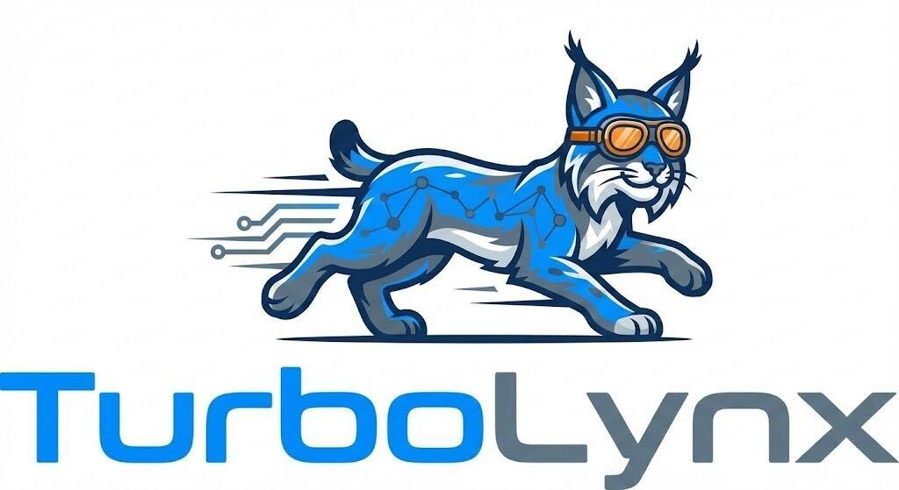

---
hide:
  - navigation
  - toc
---

<div class="hero">
  
  <h1 class="hero-title">Turbo<span>Lynx</span></h1>
  <p class="hero-tagline">Fast, scalable OLAP graph database in C++17 — Cypher query interface, cost-based optimizer, zero system dependencies.</p>
  <div class="hero-badges">
    <span class="hero-badge">C++17</span>
    <span class="hero-badge">Cypher</span>
    <span class="hero-badge">ORCA Optimizer</span>
    <span class="hero-badge">Single-process Embedded</span>
    <span class="hero-badge">No System Libraries</span>
  </div>
  <div class="hero-buttons">
    <a href="documentation/getting-started/quickstart/" class="md-button md-button--primary">Get Started</a>
    <a href="installation/overview/" class="md-button">Installation</a>
    <a href="https://github.com/your-org/turbograph-v3" class="md-button">GitHub</a>
  </div>
</div>

## Why TurboLynx?

<div class="feature-grid">

<div class="feature-card">
<span class="feature-icon">⚡</span>

### OLAP-Grade Performance
Extent-based columnar storage and async kernel I/O designed for read-heavy analytical graph workloads at scale.
</div>

<div class="feature-card">
<span class="feature-icon">🔗</span>

### Cypher Query Language
Full Cypher syntax support with cost-based join selection — index join, hash join, and merge join selected automatically by the ORCA optimizer.
</div>

<div class="feature-card">
<span class="feature-icon">📦</span>

### Embedded by Design
Single-process architecture, no daemon, no shared memory. Integrates directly into your application like DuckDB or SQLite.
</div>

<div class="feature-card">
<span class="feature-icon">🔧</span>

### Zero System Dependencies
Builds from standard compiler toolchain only. All runtime dependencies — NUMA, AIO, thread scheduling — compiled directly into the binary.
</div>

<div class="feature-card">
<span class="feature-icon">🧠</span>

### ORCA Optimizer
Cost-based query optimizer from Greenplum, ported for graph queries. Handles complex multi-hop traversals with optimal join ordering.
</div>

<div class="feature-card">
<span class="feature-icon">🗂️</span>

### Persistent Catalog
Schema persisted as a compact binary file (`catalog.bin`). Zero re-scan on startup — your graph is ready in milliseconds.
</div>

</div>

## Quick Start

```bash
# 1. Build
git clone <repo-url> turbograph-v3 && cd turbograph-v3
mkdir build && cd build
cmake -GNinja -DCMAKE_BUILD_TYPE=Release -DENABLE_TCMALLOC=OFF \
      -DBUILD_UNITTESTS=OFF -DTBB_TEST=OFF ..
ninja

# 2. Load dataset
./tools/bulkload --workspace /path/to/db --data /path/to/dataset

# 3. Query
./tools/client --workspace /path/to/db
```

```cypher
TurboLynx >> MATCH (a:Person)-[:KNOWS]->(b:Person)
             WHERE a.firstName = 'Alice'
             RETURN b.firstName, b.lastName
             LIMIT 20;
```

[Full Quickstart Guide →](documentation/getting-started/quickstart.md){ .md-button .md-button--primary }
